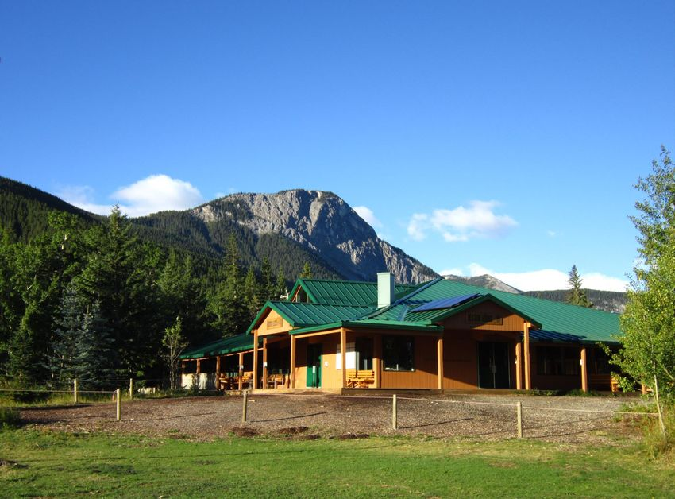

**WORKING DRAFT!**
## Introduction

Though I have some hearing loss and tinnitus, and I used to be functionally fluent in ASL, I'm not Deaf/deaf, Hard of Hearing, or CODA (Child of a Deaf Adult). So, instead of writing my own take on Deaf Culture and ASL 101 I'm sharing a curated list of video content by Deaf and CODA content creators and public speakers. Hopefully, this will get you started on celebrating Deaf Awareness Month and learning more about the richness of Deaf Culture and signing languages. This list should be especially helpful for other marketing and communication professionals. 

This is the first part of a two article series. I've embedded videos for each creator and public speaker in the list, so splitting the full article into two parts will help those who are reading/listening to this on mobile.

But first the story about how I learned ASL and about Deaf culture. ...

## Storytime: How I Learned ASL and About Deaf Culture

The summer I started teaching I worked at an outdoor education centre in the Rocky Mountains. On the application form were the usual things you’d you’d expect to find:​

- Do you have Standard First Aid and CPR, or Wilderness First Aid?
- What is your level of lifeguarding certification? ​
- Do you have rock climbing experience?
- Do you have canoeing certifications? ​
    
... and then there was "What is your level of ASL American Sign Language?​​"

You see, years before I worked there, the outdoor ed centre would run a one week Deaf camp at the smaller of the two lodges. Deaf kids, hard of hearing (HOH) kids, and those who are CODAs (children of deaf adults) whose first language was American Sign Language would come to spend a week in a fun environment where almost everyone spoke ASL and/or signed English.​

Because campers at both the small and big lodges would mix and share activities, some ASL started to become part of the culture for the kids and teens. And what do kids learn first from each other? How to say the bad words in a language that not all the adults know!​  

So within a few years learning some basic signed English and ASL phrases became part of staff training for everyone. There was even a session on “swearing in ASL”, but also we learned to sing songs in sign language, how to deal with Grizzly bears and Deaf kids, teach canoeing to campers who were Deaf and hard of hearing, and about Deaf culture.​

As more staff took their ASL certifications and learned ASL in staff training, it became part of the adult staff culture too. Some basic signs came in handy communicating over a group of loud kids across a big field. ASL was also very handy on nights off in loud bars and music gigs in Canmore and Banff.​
​  
By the time I started my spring and summer there, there wasn’t a separate Deaf camp session. It was just part of Centre’s mindset and the culture.​ Having an accessibility first mindset and culture benefited everyone – not just the Deaf, hard of hearing and CODA kids.​
## A Curated List of Deaf and CODA Content Creators and Public Speakers

***Tip: Turn on captions ["CC"] for all of the videos.***

One of the first things I learned about Deaf, Hard of Hearing, and CODA is that it's best to learn from those in the community and not from the hearing community. So here's a curated list of Deaf and CODA content creators and public speakers. I've included a few videos from each of them to get you started, along with links to their socials and/or website. 

In Part 1:
1. [Chrissy Marshall](#chrissy-marshall)
2. [Elizabeth "Lizzy" Harris](#elizabeth-harris)
3. [Haben Girma](#haben-grima)
4. [Jessica Kellgren-Fozard](#jessica-kellgren-fozard)
5. [Jon Urqhart](#jon-urqhart)

In Part 2:
1. [Meryl Evans](#meryl-evans)
2. [Nakia Smith](#nakia-smith)
3. [Natasha Wilcock](#natasha-wilcock)
4. [Rikki Poynter](#rikki-poynter)
5. [Ryan Alex and Ellen Mika (Deaf/hearing couple)](#sign-duo)

_______
<h3 id="chrissy-marshall">Chrissy Marshall</h3>

Chrissy Marshall is a Deaf writer and film director and a graduate of University of Southern California's School of Cinematic Arts.  She has over 192,000 followers on YouTube. Chrissy uses ASL and doesn't "voice" in her videos. She has a lot of videos that help teach hearing and non-signing people ASL, as well as popular songs. Turn on the [CC] to follow along with all of her videos. 

#### Chrissy's Socials

- Chrissy's website [https://www.chrissymarshall.com](https://www.chrissymarshall.com)
- [YouTube](https://www.youtube.com/@ChrissyMarshall_)
- [Instagram](https://www.instagram.com/chrissymarshall_/)
- [LinkedIn](https://www.linkedin.com/in/chrissy-marshall-663b4013b/)
#### Chrissy Marshall's Videos

***Turn on captions ["CC"] for all of the videos.***

- [Dos and Don'ts of Interacting with the Deaf Community](https://www.youtube.com/watch?v=pDA_EXFTpxo&t=2s)

<iframe width="560" height="315" src="https://www.youtube.com/embed/pDA_EXFTpxo?si=wOuYnV2vBMe8oXF5" title="YouTube video player" frameborder="0" allow="accelerometer; autoplay; clipboard-write; encrypted-media; gyroscope; picture-in-picture; web-share" referrerpolicy="strict-origin-when-cross-origin" allowfullscreen></iframe>

- [HELPFUL ASL SIGNS (especially for my neurodivergent friends)](https://youtu.be/lfn8b80J8EM?si=pPpiKCvME5XnJmhi)

<iframe width="560" height="315" src="https://www.youtube.com/embed/lfn8b80J8EM?si=_m-Wy01_nL1d9GxJ" title="YouTube video player" frameborder="0" allow="accelerometer; autoplay; clipboard-write; encrypted-media; gyroscope; picture-in-picture; web-share" referrerpolicy="strict-origin-when-cross-origin" allowfullscreen></iframe>

____
<h3 id="Elizabeth Harris">Elizabeth (Lizzy) Harris</h3>

Lizzy is a Deaf content creator who's had multiple videos about sign language and Deaf culture go viral. She's a new mom to a hearing daughter, is finishing college, and recently interpreted her first play. Elizabeth was raised orally, learned to sign later, and uses "simcom" (simultaneous communication) in her videos—signing with English grammar as she speaks. She enjoys music and frequently has videos of her signing in simcom or ASL. She also has really long nails which she speaks about. 

#### Elizabeth's Socials

- [YouTube](https://www.youtube.com/@L1zHarris)
- [Instagram]([instagram.com/l1z.harris](https://www.youtube.com/redirect?event=channel_description&redir_token=QUFFLUhqazlkazc1aXB5aF9XX0VrcEV4eVdkOXo2blZtUXxBQ3Jtc0tsMXowQmZGeG1sMHprZldkWHNEMmxDRzZOQ0kwdHRHellTYUZzS2d5VG1mWGtXdWJpTnVud1hlSXdIbE9mUWlRd2VZRW9Dd01mX1pqR20wOGotaXdTWjRQdXJHOFJXNmZ1a3pKQk5JdVR1UVdNM1BEZw&q=https%3A%2F%2Fwww.instagram.com%2Fl1z.harris%2F))
- [TikTok]([tiktok.com/@lizzytharris](https://www.youtube.com/redirect?event=channel_description&redir_token=QUFFLUhqbm1ocGlObk14LWVISmRmdElRN0h2R1R3ZXRrd3xBQ3Jtc0tuajJuczc5ckVsTEw5ektCNmJIVnFrUjlsX3dDUk9ZZ2RUSUdoNUVDN242N25udV8zbUdfLVpWdmJKaHNEZWk4Vk9RQW9hMU5ERHFCYnlsdTJTMmpKaEFURkxRWlN2YlpzVlFZS0U5Sk9yMEJJNnVfQQ&q=https%3A%2F%2Fwww.tiktok.com%2F%40lizzytharris))
#### Elizabeth Harris' Videos

- [Are we speaking the same language? 👀 (Tiktok): Lizzytharris](https://www.youtube.com/shorts/ePhXKRHETPM)

<iframe width="315" height="560"
src="https://youtube.com/embed/ePhXKRHETPM?si=L3XlI7VrdlJA_XLW"
title="YouTube video player"
frameborder="0"
allow="accelerometer; autoplay; clipboard-write; encrypted-media; gyroscope; picture-in-picture; web-share"
allowfullscreen></iframe>

- [Did you know that sign language has puns? 👀](https://www.youtube.com/shorts/WpcpNn8z12c)
<iframe width="315" height="560"
src="https://youtube.com/embed/WpcpNn8z12c?si=-dEKSp792tF4kXTX"
title="YouTube video player"
frameborder="0"
allow="accelerometer; autoplay; clipboard-write; encrypted-media; gyroscope; picture-in-picture; web-share"
allowfullscreen></iframe>

- [“Is sign language universal?” (Tiktok): Lizzytharris](https://www.youtube.com/shorts/3DhBzqUAzn0) A side-by-side comparison of the alphabet in ASL and BSL.
<iframe width="315" height="560"
src="https://youtube.com/embed/3DhBzqUAzn0?si=rYUyZdAvi8l2WbJX"
title="YouTube video player"
frameborder="0"
allow="accelerometer; autoplay; clipboard-write; encrypted-media; gyroscope; picture-in-picture; web-share"
allowfullscreen></iframe>

_____
<h3 id="haben-grima">Haben Grima, Deaf-Blind Lawyer, Public Speaker, Author</h3>
ADD AND EDIT CONTENT!
*The first Deafblind person to graduate from Harvard Law School, Haben Girma advocates for equal opportunities for people with disabilities. President Obama named her a White House Champion of Change, and Forbes recognized her in Forbes 30 Under 30. Haben travels the world consulting and public speaking, teaching clients the benefits of fully accessible products and services. H*

#### Haben's Socials

- [YouTube](https://www.youtube.com/@haben_girma)
- [Instagram](https://www.instagram.com/habengirma)
- [Facebook](facebook.com/habengirma)
- Website: [habengirma.com](habengirma.com)
  

#### Haben Grima's Videos

- An interview with Haben Girma, the first deaf-blind person to graduate from Harvard Law - New Day NW

<iframe width="560" height="315" src="https://www.youtube.com/embed/MOw8CgbFiuY?si=usDzHeYykTYY1xzG" title="YouTube video player" frameborder="0" allow="accelerometer; autoplay; clipboard-write; encrypted-media; gyroscope; picture-in-picture; web-share" referrerpolicy="strict-origin-when-cross-origin" allowfullscreen></iframe>

- Why I work to remove access barriers for students with disabilities | Haben Girma | TEDxBaltimore
<iframe width="560" height="315" src="https://www.youtube.com/embed/Mvoj-ku8zk0?si=tM3h_Gk8gFYfF13h" title="YouTube video player" frameborder="0" allow="accelerometer; autoplay; clipboard-write; encrypted-media; gyroscope; picture-in-picture; web-share" referrerpolicy="strict-origin-when-cross-origin" allowfullscreen></iframe>

- Uber Keeps Denying Service to Blind People with Guide Dogs – Join the Protest!

<iframe width="560" height="315" src="https://www.youtube.com/embed/ajoA3YJ8gek?si=9xildznLP2_Qug_R" title="YouTube video player" frameborder="0" allow="accelerometer; autoplay; clipboard-write; encrypted-media; gyroscope; picture-in-picture; web-share" referrerpolicy="strict-origin-when-cross-origin" allowfullscreen></iframe>

_____
<h3 id="jessica-kellgren-fozard">Jessica Kellgren-Fozard aka "Jessica Out of the Closet</h3>
Jessica is a Deaf YouTuber with almost 2 million followers. She's really fun and quite British! She speaks on a wide-range of topics including: vintage fashion, LGBTQ+ history and culture, being a disabled lesbian mom. Her wife Claudia is in many of her videos. While they show their toddler son and twin girls, they obscure their faces. In addition to being Deaf, Jessica has Ehlers-Danlos Syndrome, several neurological conditions, and ADHD. (It's though Jessica's content that I started to figure out my medical mysteries!) 

In her earlier videos Jessica signs in Signed Supported English (SSE) using British Sign Language (BSL) signs and English-language grammar. (The first video below discusses the difference.) However, as her channel grew and she got a more global audience she stopped signing as to not confuse her viewers that speak other sign languages. Her channel has human-generated captions.

#### Jessica's Socials

- [YouTube](https://www.youtube.com/@jessicaoutofthecloset)
- [Instagram](instagram.com/JessicaOutOfTheCloset)
- Blog: [jessicaoutofthecloset.co.uk](jessicaoutofthecloset.co.uk)

#### Jessica Kellgren-Fozard's Videos

- Why I Don't Sound Deaf // International Week of the Deaf [CC]

<iframe width="560" height="315" src="https://www.youtube.com/embed/72HS6nTgeOE?si=KBkL2sZ18viBZwCE" title="YouTube video player" frameborder="0" allow="accelerometer; autoplay; clipboard-write; encrypted-media; gyroscope; picture-in-picture; web-share" referrerpolicy="strict-origin-when-cross-origin" allowfullscreen></iframe>

- Who Are The 'Defective Race'?! // Alexander Graham Bell [CC]

<iframe width="560" height="315" src="https://www.youtube.com/embed/ywNPQgZscXs?si=Lk3q4vwXjMwUM79u" title="YouTube video player" frameborder="0" allow="accelerometer; autoplay; clipboard-write; encrypted-media; gyroscope; picture-in-picture; web-share" referrerpolicy="strict-origin-when-cross-origin" allowfullscreen></iframe>

- 13 Things My Hearing Friends Should Know // International Week of the Deaf [CC]

<iframe width="560" height="315" src="https://www.youtube.com/embed/xQFuL2KYRdc?si=7DYGChM1YGlBdRZB" title="YouTube video player" frameborder="0" allow="accelerometer; autoplay; clipboard-write; encrypted-media; gyroscope; picture-in-picture; web-share" referrerpolicy="strict-origin-when-cross-origin" allowfullscreen></iframe>

_____

<h3 id="jon-urqhart">Jon Urquhart - CODA (Child of a Deaf-Blind Adult)</h3>

Jon's first language was American Sign Language. He has over 350 shorts mostly about ASL and being a CODA on [YouTube](https://www.youtube.com/@Jonurquhart_) that are typically cross-posted on [Instagram](instagram.com/jonurquhart_) and [TikTok](tiktok.com/@drunkcrier?lang=en). Jon is a professional ASL interpreter and founder of [ASLSpring](https://aslspring.com).

#### Jon's Socials

- [YouTube](https://www.youtube.com/@Jonurquhart_)
- [Instagram](instagram.com/jonurquhart_)
- [TikTok](tiktok.com/@drunkcrier)
- [Facebook](facebook.com/drunkcrier)
- Company website "[ASL Spring](https://aslspring.com)"

#### Jon's Videos

<iframe width="560" height="315" src="https://www.youtube.com/embed/qp6Np0KicQQ?si=iMeLiOZZ6USfJwpe" title="YouTube video player" frameborder="0" allow="accelerometer; autoplay; clipboard-write; encrypted-media; gyroscope; picture-in-picture; web-share" referrerpolicy="strict-origin-when-cross-origin" allowfullscreen></iframe>

<blockquote class="instagram-media" data-instgrm-captioned data-instgrm-permalink="https://www.instagram.com/reel/DOMs09YEZap/?utm_source=ig_embed&amp;utm_campaign=loading" data-instgrm-version="14" style=" background:#FFF; border:0; border-radius:3px; box-shadow:0 0 1px 0 rgba(0,0,0,0.5),0 1px 10px 0 rgba(0,0,0,0.15); margin: 1px; max-width:540px; min-width:326px; padding:0; width:99.375%; width:-webkit-calc(100% - 2px); width:calc(100% - 2px);">
 <a href="https://www.instagram.com/reel/DOMs09YEZap/?utm_source=ig_embed&amp;utm_campaign=loading" style=" background:#FFFFFF; line-height:0; padding:0 0; text-align:center; text-decoration:none; width:100%;" target="_blank"> 
 

 
 

 

 
<svg width="50px" height="50px" viewBox="0 0 60 60" version="1.1" xmlns="https://www.w3.org/2000/svg" xmlns:xlink="https://www.w3.org/1999/xlink"><g stroke="none" stroke-width="1" fill="none" fill-rule="evenodd"><g transform="translate(-511.000000, -20.000000)" fill="#000000"><g><path d="M556.869,30.41 C554.814,30.41 553.148,32.076 553.148,34.131 C553.148,36.186 554.814,37.852 556.869,37.852 C558.924,37.852 560.59,36.186 560.59,34.131 C560.59,32.076 558.924,30.41 556.869,30.41 M541,60.657 C535.114,60.657 530.342,55.887 530.342,50 C530.342,44.114 535.114,39.342 541,39.342 C546.887,39.342 551.658,44.114 551.658,50 C551.658,55.887 546.887,60.657 541,60.657 M541,33.886 C532.1,33.886 524.886,41.1 524.886,50 C524.886,58.899 532.1,66.113 541,66.113 C549.9,66.113 557.115,58.899 557.115,50 C557.115,41.1 549.9,33.886 541,33.886 M565.378,62.101 C565.244,65.022 564.756,66.606 564.346,67.663 C563.803,69.06 563.154,70.057 562.106,71.106 C561.058,72.155 560.06,72.803 558.662,73.347 C557.607,73.757 556.021,74.244 553.102,74.378 C549.944,74.521 548.997,74.552 541,74.552 C533.003,74.552 532.056,74.521 528.898,74.378 C525.979,74.244 524.393,73.757 523.338,73.347 C521.94,72.803 520.942,72.155 519.894,71.106 C518.846,70.057 518.197,69.06 517.654,67.663 C517.244,66.606 516.755,65.022 516.623,62.101 C516.479,58.943 516.448,57.996 516.448,50 C516.448,42.003 516.479,41.056 516.623,37.899 C516.755,34.978 517.244,33.391 517.654,32.338 C518.197,30.938 518.846,29.942 519.894,28.894 C520.942,27.846 521.94,27.196 523.338,26.654 C524.393,26.244 525.979,25.756 528.898,25.623 C532.057,25.479 533.004,25.448 541,25.448 C548.997,25.448 549.943,25.479 553.102,25.623 C556.021,25.756 557.607,26.244 558.662,26.654 C560.06,27.196 561.058,27.846 562.106,28.894 C563.154,29.942 563.803,30.938 564.346,32.338 C564.756,33.391 565.244,34.978 565.378,37.899 C565.522,41.056 565.552,42.003 565.552,50 C565.552,57.996 565.522,58.943 565.378,62.101 M570.82,37.631 C570.674,34.438 570.167,32.258 569.425,30.349 C568.659,28.377 567.633,26.702 565.965,25.035 C564.297,23.368 562.623,22.342 560.652,21.575 C558.743,20.834 556.562,20.326 553.369,20.18 C550.169,20.033 549.148,20 541,20 C532.853,20 531.831,20.033 528.631,20.18 C525.438,20.326 523.257,20.834 521.349,21.575 C519.376,22.342 517.703,23.368 516.035,25.035 C514.368,26.702 513.342,28.377 512.574,30.349 C511.834,32.258 511.326,34.438 511.181,37.631 C511.035,40.831 511,41.851 511,50 C511,58.147 511.035,59.17 511.181,62.369 C511.326,65.562 511.834,67.743 512.574,69.651 C513.342,71.625 514.368,73.296 516.035,74.965 C517.703,76.634 519.376,77.658 521.349,78.425 C523.257,79.167 525.438,79.673 528.631,79.82 C531.831,79.965 532.853,80.001 541,80.001 C549.148,80.001 550.169,79.965 553.369,79.82 C556.562,79.673 558.743,79.167 560.652,78.425 C562.623,77.658 564.297,76.634 565.965,74.965 C567.633,73.296 568.659,71.625 569.425,69.651 C570.167,67.743 570.674,65.562 570.82,62.369 C570.966,59.17 571,58.147 571,50 C571,41.851 570.966,40.831 570.82,37.631"></path></g></g></g></svg>

 
View this post on Instagram

 

 

 

 

 

 

 

 

 

 
 

 

</a>
<a href="https://www.instagram.com/reel/DOMs09YEZap/?utm_source=ig_embed&amp;utm_campaign=loading" style=" color:#c9c8cd; font-family:Arial,sans-serif; font-size:14px; font-style:normal; font-weight:normal; line-height:17px; text-decoration:none;" target="_blank">A post shared by Jon Urquhart (@jonurquhart_)</a>

</blockquote>

<blockquote class="instagram-media" data-instgrm-captioned data-instgrm-permalink="https://www.instagram.com/reel/DLgOq3OMa4Y/?utm_source=ig_embed&amp;utm_campaign=loading" data-instgrm-version="14" style=" background:#FFF; border:0; border-radius:3px; box-shadow:0 0 1px 0 rgba(0,0,0,0.5),0 1px 10px 0 rgba(0,0,0,0.15); margin: 1px; max-width:540px; min-width:326px; padding:0; width:99.375%; width:-webkit-calc(100% - 2px); width:calc(100% - 2px);">
 <a href="https://www.instagram.com/reel/DLgOq3OMa4Y/?utm_source=ig_embed&amp;utm_campaign=loading" style=" background:#FFFFFF; line-height:0; padding:0 0; text-align:center; text-decoration:none; width:100%;" target="_blank"> 
 

 
 

 

 
<svg width="50px" height="50px" viewBox="0 0 60 60" version="1.1" xmlns="https://www.w3.org/2000/svg" xmlns:xlink="https://www.w3.org/1999/xlink"><g stroke="none" stroke-width="1" fill="none" fill-rule="evenodd"><g transform="translate(-511.000000, -20.000000)" fill="#000000"><g><path d="M556.869,30.41 C554.814,30.41 553.148,32.076 553.148,34.131 C553.148,36.186 554.814,37.852 556.869,37.852 C558.924,37.852 560.59,36.186 560.59,34.131 C560.59,32.076 558.924,30.41 556.869,30.41 M541,60.657 C535.114,60.657 530.342,55.887 530.342,50 C530.342,44.114 535.114,39.342 541,39.342 C546.887,39.342 551.658,44.114 551.658,50 C551.658,55.887 546.887,60.657 541,60.657 M541,33.886 C532.1,33.886 524.886,41.1 524.886,50 C524.886,58.899 532.1,66.113 541,66.113 C549.9,66.113 557.115,58.899 557.115,50 C557.115,41.1 549.9,33.886 541,33.886 M565.378,62.101 C565.244,65.022 564.756,66.606 564.346,67.663 C563.803,69.06 563.154,70.057 562.106,71.106 C561.058,72.155 560.06,72.803 558.662,73.347 C557.607,73.757 556.021,74.244 553.102,74.378 C549.944,74.521 548.997,74.552 541,74.552 C533.003,74.552 532.056,74.521 528.898,74.378 C525.979,74.244 524.393,73.757 523.338,73.347 C521.94,72.803 520.942,72.155 519.894,71.106 C518.846,70.057 518.197,69.06 517.654,67.663 C517.244,66.606 516.755,65.022 516.623,62.101 C516.479,58.943 516.448,57.996 516.448,50 C516.448,42.003 516.479,41.056 516.623,37.899 C516.755,34.978 517.244,33.391 517.654,32.338 C518.197,30.938 518.846,29.942 519.894,28.894 C520.942,27.846 521.94,27.196 523.338,26.654 C524.393,26.244 525.979,25.756 528.898,25.623 C532.057,25.479 533.004,25.448 541,25.448 C548.997,25.448 549.943,25.479 553.102,25.623 C556.021,25.756 557.607,26.244 558.662,26.654 C560.06,27.196 561.058,27.846 562.106,28.894 C563.154,29.942 563.803,30.938 564.346,32.338 C564.756,33.391 565.244,34.978 565.378,37.899 C565.522,41.056 565.552,42.003 565.552,50 C565.552,57.996 565.522,58.943 565.378,62.101 M570.82,37.631 C570.674,34.438 570.167,32.258 569.425,30.349 C568.659,28.377 567.633,26.702 565.965,25.035 C564.297,23.368 562.623,22.342 560.652,21.575 C558.743,20.834 556.562,20.326 553.369,20.18 C550.169,20.033 549.148,20 541,20 C532.853,20 531.831,20.033 528.631,20.18 C525.438,20.326 523.257,20.834 521.349,21.575 C519.376,22.342 517.703,23.368 516.035,25.035 C514.368,26.702 513.342,28.377 512.574,30.349 C511.834,32.258 511.326,34.438 511.181,37.631 C511.035,40.831 511,41.851 511,50 C511,58.147 511.035,59.17 511.181,62.369 C511.326,65.562 511.834,67.743 512.574,69.651 C513.342,71.625 514.368,73.296 516.035,74.965 C517.703,76.634 519.376,77.658 521.349,78.425 C523.257,79.167 525.438,79.673 528.631,79.82 C531.831,79.965 532.853,80.001 541,80.001 C549.148,80.001 550.169,79.965 553.369,79.82 C556.562,79.673 558.743,79.167 560.652,78.425 C562.623,77.658 564.297,76.634 565.965,74.965 C567.633,73.296 568.659,71.625 569.425,69.651 C570.167,67.743 570.674,65.562 570.82,62.369 C570.966,59.17 571,58.147 571,50 C571,41.851 570.966,40.831 570.82,37.631"></path></g></g></g></svg>

 
View this post on Instagram

 

 

 

 

 

 

 

 

 

 
 

 

</a>
<a href="https://www.instagram.com/reel/DLgOq3OMa4Y/?utm_source=ig_embed&amp;utm_campaign=loading" style=" color:#c9c8cd; font-family:Arial,sans-serif; font-size:14px; font-style:normal; font-weight:normal; line-height:17px; text-decoration:none;" target="_blank">A post shared by Jon Urquhart (@jonurquhart_)</a>

</blockquote>

____
## Share This Article on LinkedIn

<!-- LinkedIn (url, title, summary, source url) -->
<a href="https://www.linkedin.com/shareArticle?mini=true&url=https://www.gingerkiwi.blog/blog/2025/09-05-deaf-awareness-month-part1&title=Deaf%20Awareness%20Month%3A%20A%20Curated%20List%20of%20Content%20by%20Deaf%20and%20CODA%20Creators%20and%20Public%20Speakers%20(Part%201)&summary=September%20is%20Deaf%20Awareness%20Month.%20Though%20I%20have%20some%20hearing%20loss%20and%20tinnitus%2C%20and%20I%20used%20to%20be%20functionally%20fluent%20in%20ASL%2C%20I'm%20not%20Deaf%2Fdeaf%2C%20Hard%20of%20Hearing%2C%20or%20CODA%20(Child%20of%20a%20Deaf%20Adult).%20So%2C%20instead%20of%20writing%20my%20own%20take%20on%20Deaf%20Culture%20and%20ASL%20101%20I'm%20sharing%20a%20curated%20list%20of%20video%20content%20by%20Deaf%20and%20CODA%20content%20creators%20and%20public%20speakers.%20This%20article%20should%20be%20especially%20helpful%20for%20marketing%20and%20communication%20professionals.%20(Part%201%20of%202)"
   target="_blank" 
   rel="noopener noreferrer"
   aria-label="Share this article on LinkedIn">
   Share on LinkedIn
</a>
_____

Continue reading part 2 to learn more about sign languages, Deaf/HOH, and CODA culture though video.

____
## Credits

1. Cover Image: Flag of the Deaf Community
	1. [Wikimedia Commons](https://commons.wikimedia.org/wiki/File:Flag_of_the_Deaf_Community.jpg): Bandiera realizzata da Arnaud Balard, 21 June 2021, 15:19:55 Original Source: realizzato da MacMoreno su mia richiesta:[diff=121433676&oldid=121433517](https://en.wikipedia.org/wiki/it:progetto:laboratorio_grafico/Immagini_da_migliorare "w:it:progetto:laboratorio grafico/Immagini da migliorare"),[diff=121434765&oldid=121432456](https://en.wikipedia.org/wiki/it:discussioni_utente:Yiyi "w:it:discussioni utente:Yiyi") Author: MacMoreno.

​

